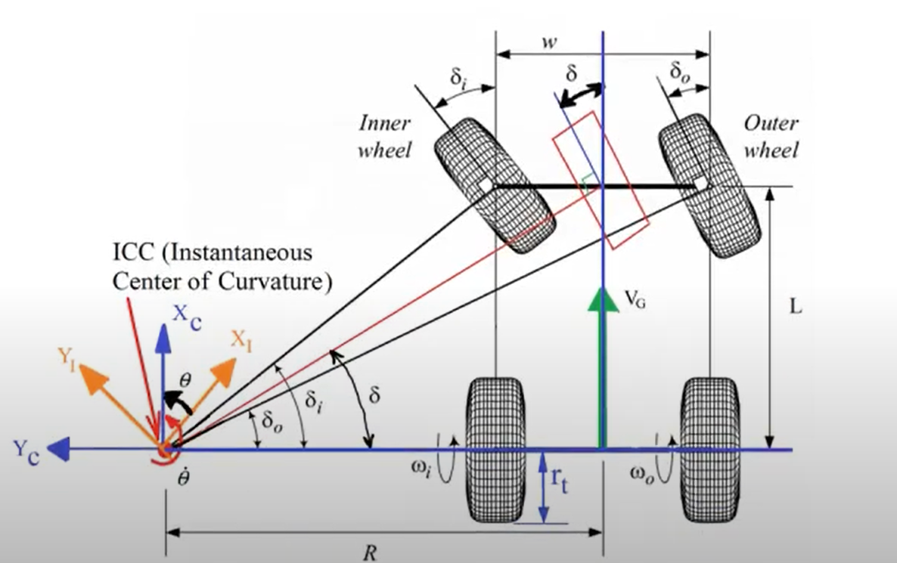

# Propuesta de PPS / Trabajo Integrador

Profesor: Pedroni Juan.  
Alumno: Moroz Esteban.

## Objetivos Etapa I

- Entender el funcionamiento del microcontrolador ESP32 para poder aplicarlo en el procesamiento de variables de fisicas relacionadas al automovil a controlar.

- Investigar y conocer sobre el modelado de diseño geometrico de Ackermann para el correcto funcionamiento del prototipo de automovil.

- Investigar y conocer sobre el algoritmo del filtro de Kalman para coreccion de errores de posicion.

- Generar un alogoritmo de control de velocidad y posicion relativa del vehiculo.

- Utilizar un conjunto de sensores para poder determinar el angulo (posicion angular) del vehiculo en el espacio.

- Diseñar y aplicar el modelo de controlador PID.

- Utilizar los encoders incluidos en el portotipo para controlar la trayectoria del vehiculo.

- Diseñar con el microcontrolador ESP32 una interfaz de usuario, utilizando el modulo WIFI del dispositivo, permitiendo asi el control del prototipo desde un telefono celular, pudiendo observar los graficos de control de variables de posicion, trayectoria, velocidad y angulo de giro del vehiculo, entre otras aplicaciones que puedan surgir del desarrollo de la misma.

- Aplicar modelos de desarrollo de software como la metodologia "Agile", implementando control de errores y control de calidad de software.

- Aplicar el modelo FreeRTOS embebido en el microcontrolador, pudiendo realizar tareas concurrentes gracias a sus multiples nucleos.

## MODELO DE ACKERMANN

## Esquema del vehículo Ackermann

## Fórmulas de dirección del vehículo

Parámetros:

- **L**: distancia entre ejes (*wheelbase*)  
- **w**: ancho de vía (*track width*)  
- **R**: radio de giro  
- **δᵢ**: ángulo de dirección de la rueda interior  
- **δₒ**: ángulo de dirección de la rueda exterior  
- **δ**: ángulo de dirección promedio  
- **Vg**: velocidad global

---

### Ángulo de la rueda interior

$$
\tan(\delta_i) = \frac{L}{R - \frac{w}{2}}
$$

Este angulo se obtiene al dividir el cateto opuesto sobre el cateto adyacente del diagrama de triangulos del vehiculo, su resultado es el largo entre los ejes de chasis sobre el radio formado por el centro de las ruedas traseras menos el ancho del chasis dividido entre dos.

### Ángulo de la rueda exterior

$$
\tan(\delta_o) = \frac{L}{R + \frac{w}{2}}
$$

Similar al angulo de rueda interior, la rueda exterior tiene una tangente de su angulo como la relacion del largo entre ejes sobre el radio formado por el centro del vehiculo menos el ancho mas dos (parte mas externa).

### Ángulo promedio de dirección

$$
\tan(\delta) = \frac{L}{R}
$$
Esta es la relacion entre el largo del vehiculo y el radio formado al mover el servo (δ) grados

## Dinámica de ruedas (cinemática de Ackermann)

### Velocidades angulares de las ruedas en función del radio de giro

Sea $\dot{\theta}$  la velocidad angular del vehículo, $r_t$  el radio de las ruedas, y $ V_G $ la velocidad del centro del vehículo:

$$
\begin{cases}
(R + \frac{w}{2}) \dot{\theta}  = r_t \omega_o \\
(R - \frac{w}{2}) \dot{\theta} = r_t \omega_i
\end{cases}
$$
Esta igualdad se puede aplicar solamente cuando el coeficiente de deslizamiento del vehiculo es infima o inexistente.

---

### Velocidad del vehículo

$$
2R \dot{\theta} = 2V_G = r_t \omega_o + r_t \omega_i \Rightarrow V_G = \frac{r_t \omega_o + r_t \omega_i}{2}
$$
Al tener un cuerpo rigido, la velocidad general del vehiculo (global) es el promedio de las velocidades tangenciales de las ruedas anexadas a la parte trasera del chasis.

---

### Relación entre velocidad lateral y velocidades angulares

$$
\begin{cases}
\frac{w V_G}{R} = r_t (\omega_o - \omega_i) \\
2V_G = r_t \omega_o + r_t \omega_i
\end{cases}
$$

---

### Cálculo explícito de velocidades angulares
Resolviendo las ecuaciones anteriores para $w_o$ y $w_i$, se obtiene las distintas velocidades angulares para cada una de las ruedas
$$
\begin{aligned}
\omega_o &= \frac{V_G \left(2 + \frac{w}{R} \right)}{2r_t} \\
\omega_i &= \frac{V_G \left(2 - \frac{w}{R} \right)}{2r_t}
\end{aligned}
$$

Esto es de suma importancia, ya que nos permite calcular la velocidad angular de cada una de las ruedas, medida con un encoder y controlada por un controlador PID.

## DFK Equations – Robot Kinetics

### Cinemática del centro del vehículo

$$
\begin{aligned}
\dot{X} &= V_G \cos(\theta) \\
\dot{Y} &= V_G \sin(\theta) \\
\dot{\theta} &= \frac{V_G}{R} = \frac{V_G}{\frac{L}{\tan(\delta)}} = \frac{V_G \tan(\delta)}{L}
\end{aligned}
$$

---

### Supuesto: dirección constante

Si

$$
\tan(\delta) = \frac{L}{R} = \text{constante}
$$

entonces

$$
\dot{\theta} = \frac{V_G}{R} = \text{constante} \Rightarrow \theta = \frac{V_G}{R} t + \theta_0
$$

---

### Tiempo para una vuelta completa

$$
T = \frac{2\pi}{\omega} = \frac{2\pi}{\frac{V_G}{R}} = \frac{2\pi R}{V_G}
$$
Este calculo puede ser util para corroborar el tiempo utilizado para realizar un giro o una fraccion de este.
