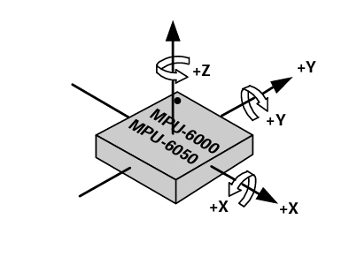
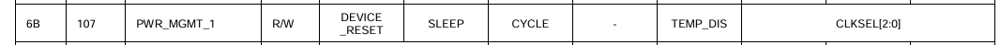
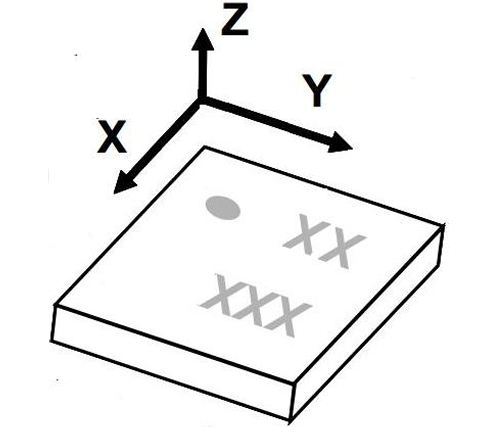
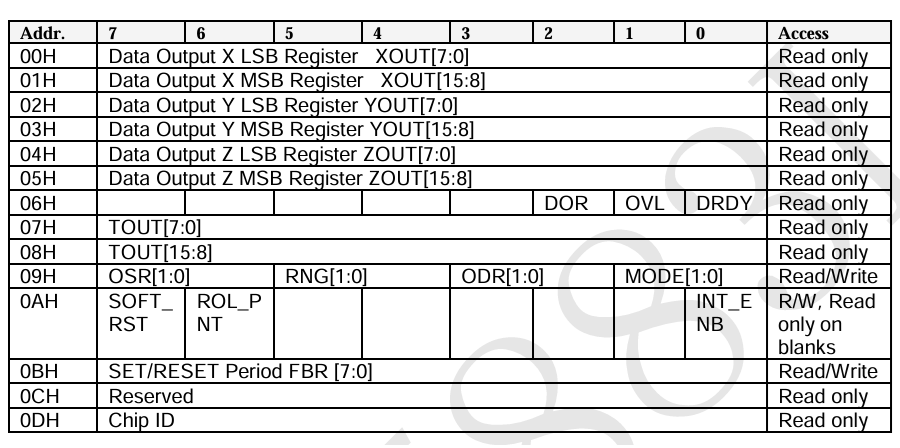
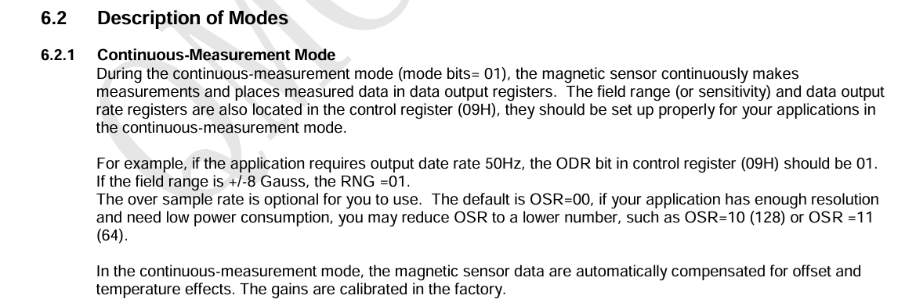
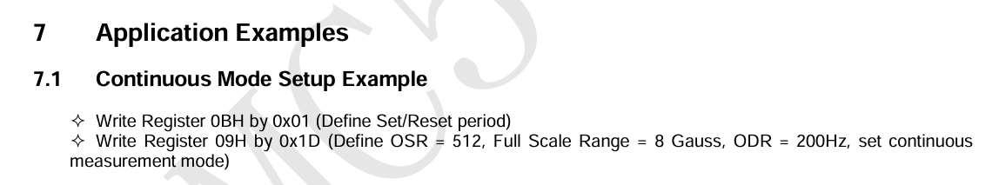
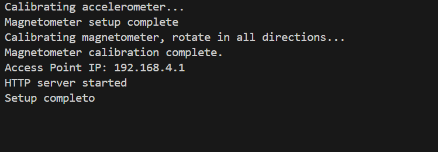
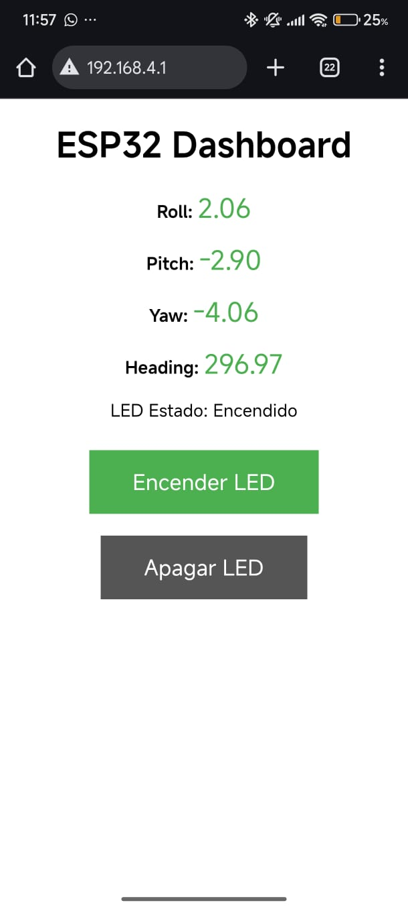

# Propuesta de PPS / Trabajo Integrador

Profesor: Pedroni Juan.  
Alumno: Moroz Esteban.

## Objetivos Etapa I

- Entender el funcionamiento del microcontrolador ESP32 para poder aplicarlo en el procesamiento de variables de fisicas relacionadas al automovil a controlar.

- Investigar y conocer sobre el modelado de diseño geometrico de Ackermann para el correcto funcionamiento del prototipo de automovil.

- Investigar y conocer sobre el algoritmo del filtro de Kalman para coreccion de errores de posicion.

- Generar un alogoritmo de control de velocidad y posicion relativa del vehiculo.

- Utilizar un conjunto de sensores para poder determinar el angulo (posicion angular) del vehiculo en el espacio.

- Diseñar y aplicar el modelo de controlador PID.

- Utilizar los encoders incluidos en el portotipo para controlar la trayectoria del vehiculo.

- Diseñar con el microcontrolador ESP32 una interfaz de usuario, utilizando el modulo WIFI del dispositivo, permitiendo asi el control del prototipo desde un telefono celular, pudiendo observar los graficos de control de variables de posicion, trayectoria, velocidad y angulo de giro del vehiculo, entre otras aplicaciones que puedan surgir del desarrollo de la misma.

- Aplicar modelos de desarrollo de software como la metodologia "Agile", implementando control de errores y control de calidad de software.

- Aplicar el modelo FreeRTOS embebido en el microcontrolador, pudiendo realizar tareas concurrentes gracias a sus multiples nucleos.


## MODELO DE ACKERMANN

## Esquema del vehículo Ackermann


## Fórmulas de dirección del vehículo

Parámetros:

- **L**: distancia entre ejes  
- **w**: ancho de vía 
- **R**: radio de giro  
- **δᵢ**: ángulo de dirección de la rueda interior  
- **δₒ**: ángulo de dirección de la rueda exterior  
- **δ**: ángulo de dirección promedio  
- **Vg**: velocidad global


---

### Ángulo de la rueda interior

$$
\tan(\delta_i) = \frac{L}{R - \frac{w}{2}}
$$

Este angulo se obtiene al dividir el cateto opuesto sobre el cateto adyacente del diagrama de triangulos del vehiculo, su resultado es el largo entre los ejes de chasis sobre el radio formado por el centro de las ruedas traseras menos el ancho del chasis dividido entre dos.

### Ángulo de la rueda exterior

$$
\tan(\delta_o) = \frac{L}{R + \frac{w}{2}}
$$

Similar al angulo de rueda interior, la rueda exterior tiene una tangente de su angulo como la relacion del largo entre ejes sobre el radio formado por el centro del vehiculo menos el ancho mas dos (parte mas externa).


### Ángulo promedio de dirección

$$
\tan(\delta) = \frac{L}{R}
$$

Esta es la relacion entre el largo del vehiculo y el radio formado al mover el servo (δ) grados


## Dinámica de ruedas (cinemática de Ackermann)

### Velocidades angulares de las ruedas en función del radio de giro

Sea $\dot{\theta}$  la velocidad angular del vehículo, $r_t$  el radio de las ruedas, y $ V_G $ la velocidad del centro del vehículo:

$$
\begin{cases}
(R + \frac{w}{2}) \dot{\theta}  = r_t \omega_o \\
(R - \frac{w}{2}) \dot{\theta} = r_t \omega_i
\end{cases}
$$

Esta igualdad se puede aplicar solamente cuando el coeficiente de deslizamiento del vehiculo es infima o inexistente.


---

### Velocidad del vehículo

$$
2R \dot{\theta} = 2V_G = r_t \omega_o + r_t \omega_i \Rightarrow V_G = \frac{r_t \omega_o + r_t \omega_i}{2}
$$

Al tener un cuerpo rigido, la velocidad general del vehiculo (global) es el promedio de las velocidades tangenciales de las ruedas anexadas a la parte trasera del chasis.

---

### Relación entre velocidad lateral y velocidades angulares

$$
\begin{cases}
\frac{w V_G}{R} = r_t (\omega_o - \omega_i) \\
2V_G = r_t \omega_o + r_t \omega_i
\end{cases}
$$

---

### Cálculo explícito de velocidades angulares
Resolviendo las ecuaciones anteriores para $w_o$ y $w_i$, se obtiene las distintas velocidades angulares para cada una de las ruedas

$$
\begin{aligned}
\omega_o &= \frac{V_G \left(2 + \frac{w}{R} \right)}{2r_t} \\
\omega_i &= \frac{V_G \left(2 - \frac{w}{R} \right)}{2r_t}
\end{aligned}
$$

Esto es de suma importancia, ya que nos permite calcular la velocidad angular de cada una de las ruedas, medida con un encoder y controlada por un controlador PID.


## DFK Equations – Robot Kinetics

### Cinemática del centro del vehículo

$$
\begin{aligned}
\dot{X} &= V_G \cos(\theta) \\
\dot{Y} &= V_G \sin(\theta) \\
\dot{\theta} &= \frac{V_G}{R} = \frac{V_G}{\frac{L}{\tan(\delta)}} = \frac{V_G \tan(\delta)}{L}
\end{aligned}
$$


---


### Supuesto: dirección constante

Si

$$
\tan(\delta) = \frac{L}{R} = \text{constante}
$$

entonces

$$
\dot{\theta} = \frac{V_G}{R} = \text{constante} \Rightarrow \theta = \frac{V_G}{R} t + \theta_0
$$

---


### Tiempo para una vuelta completa

$$
T = \frac{2\pi}{\omega} = \frac{2\pi}{\frac{V_G}{R}} = \frac{2\pi R}{V_G}
$$

Este calculo puede ser util para corroborar el tiempo utilizado para realizar un giro o una fraccion de este.


# Introduccion a sensores 

## IMU MPU6050

Este dispositivo(Inertial Measurment Units) es utilizado para medir la velocidad angular en tres ejes (x,y,z) por medio del efecto coriolis y a su vez permite sensar la aceleracion vertical en cada uno de estos tres ejes.




Cada uno de estas aplicaciones (acelerometro y giroscopio) se encuentra clasificada en el respectivo datasheet del dispositivo de sensado.

## Datasheet de la MPU6050

### Registros del sensor

```cpp

#define MPU_ADDR 0x68

void Accelerometer::begin() {
    Wire.begin(21, 22, 400000);
    delay(250);
    Wire.beginTransmission(MPU_ADDR);
    Wire.write(0x6B);
    Wire.write(0);
    Wire.endTransmission(true);
}

```
El sensor puede ser leido desde la direccion 0x68H.

Se utilizan como SDA (signal data) y SCL (signal clock) a los pines 21 y 22 respectivamente.

La frecuencia maxima para la cominicacion en I2C es de 400kHz, es por esta razon que se utiliza 400000 como tercer variable a en la funcion begin() de Wire cuya principal funcion es permitirnos la comunicacion por medio del metodo I2C.

Para "despertar" al sensor el instructivo indica que se debe escribir 0X0 en el registro 0x6BH.



Con esto, se puede inicializar el sensor correspondiente desde el archivo main ubicado en src/main.cpp.

```cpp

//main.cpp:
Accelerometer accel; //instancia de acelerometro
accel.begin(); // Configurar el giroscopio

```

El codigo de control de los sensores a sido creado como clases(o instancias de clase) de cpp, esto nos permite modularizar mejor el codigo, facilita la reutilizacion del mismo, ayuda a tener una mejor organizacion del mismo y permite un nivel de abtraccion superior. Las instancias de acelerometro y magnetometro son utilizadas en el servidor web, creado a partir de tener al dispositivo ESP32 como access point.


### Funciones restantes de la libreria "acelerometro.h"
```cpp

void Accelerometer::update() {
    Wire.beginTransmission(MPU_ADDR);
    Wire.write(0x43);
    Wire.endTransmission();
    Wire.requestFrom(MPU_ADDR, 6);

    GyX = (Wire.read() << 8) | Wire.read();
    GyY = (Wire.read() << 8) | Wire.read();
    GyZ = (Wire.read() << 8) | Wire.read();

    rateRoll = (float)GyX / 65.5 - calibRoll;
    ratePitch = (float)GyY / 65.5 - calibPitch;
    rateYaw = (float)GyZ / 65.5 - calibYaw;
}

void Accelerometer::calibrate() {
    printf("Calibrating accelerometer...\n");
    calibRoll = calibPitch = calibYaw = 0;
    for (int i = 0; i < 3000; i++) {
        update();
        calibRoll += rateRoll;
        calibPitch += ratePitch;
        calibYaw += rateYaw;
        delay(1);
    }
    calibRoll /= 3000.0;
    calibPitch /= 3000.0;
    calibYaw /= 3000.0;
}

float Accelerometer::getRoll() const { return rateRoll; }
float Accelerometer::getPitch() const { return ratePitch; }
float Accelerometer::getYaw() const { return rateYaw; }
```
La funcion calibrate() nos permite calibrar el sensor, para esto se debe procurar mantener el sensor completamente estatico, ya que esto permite analizar el error propio del mismo y generar los offsets correspondientes para corregir los errores en el futuro. 

Esta funcion esta pensada para ser utilizada en cualquier momento en el tiempo de uso del dispositivo.

Mientras tanto, update() se encarga de leer los datos provinientes de los registro de lectura del sensor (en este caso leemos solamente los datos de velocidad angular del giroscopio) y corregirlos con los offsets obtenidos de la funcion calibrate().

En el loop del codigo principal (main.cpp), se actualizan los datos para ser mostrados luego en el servidor.


## Magnetometro HMC5883l(QMC)

Este dispositivo permite sensar los cambios de campo magnetico en los tres ejes espaciales (x,y,z).

El objetivo principal es sensar el norte magnetico de la tierra y obtener una referencia espacial en angulos.

## Datasheet del sensor HMC5883l (QMC)

### Registros del sensor


Las lecturas del sensor se encuentran entre los registros (0x00H - 0x05H).

Los registros (0x09H - 0xBH) son utilizados para el control del dispositivo.

```cpp
Magnetometer::Magnetometer()
    : magX_Gauss(0), magY_Gauss(0), magZ_Gauss(0),
      magMinX(32767), magMinY(32767), magMinZ(32767),
      magMaxX(-32768), magMaxY(-32768), magMaxZ(-32768),
      declination(-0.10f) {}

void Magnetometer::begin() {
    Wire.begin(21, 22, 400000);
    delay(250);

    Wire.beginTransmission(MAG_ADDR);
    Wire.write(0x0B); // Control Register
    Wire.write(0x01);
    Wire.endTransmission();

    Wire.beginTransmission(MAG_ADDR);
    Wire.write(0x09); 
    Wire.write(0x1D);
    Wire.endTransmission();

    Serial.println("Magnetometer setup complete");
}

```

Utilizamos un contructor de clase para inicializar la instancia de clase del magnetometro.

Al igual que el acelerometro, existe una funcion begin en esta clase, esta nos permite utilizar lso pines SDA y SCL compartidos con la MPU6050 ya que estan ubicadas en registros de I2C distintos.




En el datasheet se encuentran disponibles una serie de instrucciones a seguir para poder poner en funcionamiento al sensor.

El modo continuo nos permite medir de manera continua los datos del sensor, ya que por default este no nos permite realizar este tipo de medidas ya que se encuentra en el single-measurement-mode. 




En esta seccion se muestran los pasos a seguir para activar el modo de medicion continua-constante.

Se debe escribir 0x01 en el registo 0x0BH y 0x1D en el registro de control 0x09H.


### Funciones restantes de la clase
```cpp
bool Magnetometer::dataReady() {
    Wire.beginTransmission(MAG_ADDR);
    Wire.write(0x06); // Status register
    Wire.endTransmission(false);
    Wire.requestFrom(MAG_ADDR, 1);

    if (Wire.available()) {
        byte status = Wire.read();
        return status & 0x01; // Bit 0 = DRDY
    }
    return false;
}

void Magnetometer::update() {
    if (!dataReady()) return;

    Wire.beginTransmission(MAG_ADDR);
    Wire.write(0x00);
    Wire.endTransmission(false);
    Wire.requestFrom(MAG_ADDR, 6);

    if (Wire.available() == 6) {
        int16_t magX_raw = Wire.read() | (Wire.read() << 8);
        int16_t magY_raw = Wire.read() | (Wire.read() << 8);
        int16_t magZ_raw = Wire.read() | (Wire.read() << 8);

        // Offset y escala
        float offsetX = (magMaxX + magMinX) / 2.0;
        float offsetY = (magMaxY + magMinY) / 2.0;
        float scaleX = (magMaxX - magMinX) / 2.0;
        float scaleY = (magMaxY - magMinY) / 2.0;

        float normX = ((float)magX_raw - offsetX) / scaleX;
        float normY = ((float)magY_raw - offsetY) / scaleY;

        magX_Gauss = normX;
        magY_Gauss = normY;
        magZ_Gauss = (float)magZ_raw; // Opcional: podés escalar si querés
    }
}

void Magnetometer::calibrate() {
    Serial.println("Calibrating magnetometer, rotate in all directions...");
    delay(1000);
    magMinX = magMinY = magMinZ = 32767;
    magMaxX = magMaxY = magMaxZ = -32768;

    unsigned long startTime = millis();
    while (millis() - startTime < 10000) {
        Wire.beginTransmission(MAG_ADDR);
        Wire.write(0x00);
        Wire.endTransmission(false);
        Wire.requestFrom(MAG_ADDR, 6);

        if (Wire.available() == 6) {
            int16_t mx = Wire.read() | (Wire.read() << 8);
            int16_t my = Wire.read() | (Wire.read() << 8);
            int16_t mz = Wire.read() | (Wire.read() << 8);

            if (mx < magMinX) magMinX = mx;
            if (mx > magMaxX) magMaxX = mx;
            if (my < magMinY) magMinY = my;
            if (my > magMaxY) magMaxY = my;
            if (mz < magMinZ) magMinZ = mz;
            if (mz > magMaxZ) magMaxZ = mz;
        }
        delay(50);
    }

    Serial.println("Magnetometer calibration complete.");
}

float Magnetometer::getX() const {
    return magX_Gauss;
}

float Magnetometer::getY() const {
    return magY_Gauss;
}

float Magnetometer::getZ() const {
    return magZ_Gauss;
}

float Magnetometer::getHeadingDegrees() const {
    float heading = atan2(magY_Gauss, magX_Gauss);
    float headingDegrees = heading * 180.0 / PI;

    if (headingDegrees < 0)
        headingDegrees += 360.0;

    return headingDegrees + declination;
}
```

Aqui podemos observar el primer problema a futuro, ya que el sensor qmc y hmc5883l debe ser calibrado con un movimiento constante para poder sensar los distintos cambios de campo magnetico terrestre de acuerdo a la rotacion a la que este puede ser sometido. Incompatible con el acelerometro MPU6050 que requiere estar en un estado estatico(sin moverse).

calibrate() refleja este inconveniente, ya que se toma como referencia un maximo de campo magnetico y un minimo de campo magnetico. Fueron utilizados los datos en crudo del sensor para realizar la calibracion ya que al diferencia del sensor HMC, el QMC no cuenta con una transformacion (escala) clara y se debe utilizar un maximo y un minimo temporal.

El offset es obtenido de la suma entre el maximo y el minimo promediados y el factor de escala del promedio de la resta. Este ultimo tiene sentido ya que la resta nos muestra la distancia entre el campo magnetico al norte y el campo magnetico al sur (360º) y al ser un movimiento periodico, nos da una suerte de precision mayor.

update() obtiene los valores actuales del sensor y estima la medida en grados en conjunto con la funcion getHeadingDegrees(), en la cual se suma la declinacion magnetica de la ubicacion actual.


# Servidor ESP




