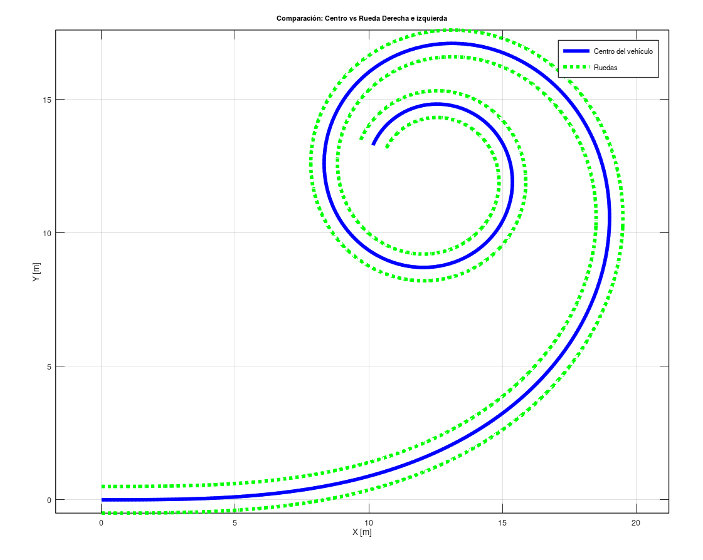

``` matlab
clear; clc; close all;

%% Parámetros del vehículo
v   = 2;
L   = 2.5;
Tsim= 30;
dt  = 0.01;
w   = 1;
rt  = 0.75;

%% Discretización
N = floor(Tsim/dt) + 1;
t = (0:N-1)*dt;

%% Inicialización
Xc = zeros(1,N);  Yc = zeros(1,N); theta = zeros(1,N);
Xr = zeros(1,N);  Yr = zeros(1,N);
Xr_bad = zeros(1,N);  Yr_bad = zeros(1,N); thetar_bad = zeros(1,N);
Xr_ref = zeros(1,N);  Yr_ref = zeros(1,N);
w_R = zeros(1,N); w_L = zeros(1,N); delta = zeros(1,N);

%% Condiciones iniciales
Xc(1)=0; Yc(1)=0; theta(1)=0;
Xr(1)=Xc(1); Yr(1)=Yc(1)-(w/2);
Xl(1)=Xc(1); Yl(1)=Yc(1)+(w/2);

%% Simulación
for k = 1:N-1
    delta(k) = (pi/4)*(t(k)/Tsim);

    w_R(k) = (v/rt) * ((2*L + w*tan(delta(k)))/(2*L));
    w_L(k) = (v/rt) * ((2*L - w*tan(delta(k)))/(2*L));
    v_R = w_R(k)*rt;
    v_L = w_L(k)*rt;

    v_c = (v_R + v_L)/2;
    yawRate = (v_R - v_L)/w;

    dx_c = v_c * cos(theta(k));
    dy_c = v_c * sin(theta(k));
    dtheta = yawRate;

    Xc(k+1) = Xc(k) + dx_c*dt;
    Yc(k+1) = Yc(k) + dy_c*dt;
    theta(k+1) = theta(k) + dtheta*dt;


    %% calculo de la posicion de la rueda derecha
    dx_r = v_R * cos(theta(k));
    dy_r = v_R * sin(theta(k));

    Yr(k+1) = Yr(k) + dy_r*dt;
    Xr(k+1) =  Xr(k) + dx_r*dt;

    %% calculo de la posicion de la rueda izquierda
    dx_l = v_L * cos(theta(k));
    dy_l = v_L * sin(theta(k));

    Yl(k+1) = Yl(k) + dy_l*dt;
    Xl(k+1) =  Xl(k) + dx_l*dt;
end

%% Graficar
figure;
plot(Xc,Yc,'b','LineWidth',2); hold on;
plot(Xr,Yr,'g:','LineWidth',2);
plot(Xl,Yl,'g:','LineWidth',2);
xlabel('X [m]'); ylabel('Y [m]');
title('Comparación: Centro vs Rueda Derecha e izquierda');
legend('Centro del vehículo','Ruedas');
grid on; axis equal;

```

## Esquema del vehículo Ackermann


En el modelo de ackermann se observa que el radio R es dependiente de cambio de $\delta$ (steering angle), sin embargo, el cambio del angulo de giro del automovil no altera el hecho que la rueda interior tiene una velocidad angular menor que la rueda externa ($w_o$ y $w_i$), estas velocidades son reemplazadas por $w_r$ y $w_l$ simbolizando la izquierda y la derecha.

El cambio del angulo de la nariz del vehiculo (yaw) es el mismo para ambas ruedas, y es la razon de la diferencia de velocidades angulares, nacido de la formula:

$$
\dot{\theta} = \frac{V}{R}
$$

Al tener un menor radio de giro, la velocidad lineal tambien debe cambiar, para mantener constante el cambio de angulo o velocidad angular.


De este hecho se inspiran las siguientes lineas:

```matlab 
%% Condiciones iniciales
Xc(1)=0; Yc(1)=0; theta(1)=0;
Xr(1)=Xc(1); Yr(1)=Yc(1)-(w/2);
Xl(1)=Xc(1); Yl(1)=Yc(1)+(w/2);

%% Simulación
for k = 1:N-1
    delta(k) = (pi/4)*(t(k)/Tsim);

    w_R(k) = (v/rt) * ((2*L + w*tan(delta(k)))/(2*L));
    w_L(k) = (v/rt) * ((2*L - w*tan(delta(k)))/(2*L));
    v_R = w_R(k)*rt;
    v_L = w_L(k)*rt;

    v_c = (v_R + v_L)/2;
    yawRate = (v_R - v_L)/w;

    dx_c = v_c * cos(theta(k));
    dy_c = v_c * sin(theta(k));
    dtheta = yawRate;

    Xc(k+1) = Xc(k) + dx_c*dt;
    Yc(k+1) = Yc(k) + dy_c*dt;
    theta(k+1) = theta(k) + dtheta*dt;

    R = v_c / dtheta;

    %% calculo de la posicion de la rueda derecha
    dx_r = v_R * cos(theta(k));
    dy_r = v_R * sin(theta(k));

    Yr(k+1) = Yr(k) + dy_r*dt;
    Xr(k+1) =  Xr(k) + dx_r*dt;

    %% calculo de la posicion de la rueda izquierda
    dx_l = v_L * cos(theta(k));
    dy_l = v_L * sin(theta(k));

    Yl(k+1) = Yl(k) + dy_l*dt;
    Xl(k+1) =  Xl(k) + dx_l*dt;
end
```

Donde se tiene la velocidad del centro del vehiculo (cuerpo rigido) y las velocidades lineales deducidas de las direrentes velocidades angulares, obtenidas del cambio de $\delta$ o del angulo yaw de la nariz del vehiculo.


Se deduce:

$$
\dot{\theta_R } = \dot{\theta_C} = \dot{\theta_L} =  \dot{\theta}
$$
Para la rueda derecha:

$$
\begin{aligned}
\dot{X_r} &= V_R \cos(\theta) \\
\dot{Y_r} &= V_R \sin(\theta) \\
\dot{\theta} &= \frac{V_G}{R} = \frac{V_G}{\frac{L}{\tan(\delta)}} = \frac{V_G \tan(\delta)}{L}
\end{aligned}
$$

Para la rueda izquierda:
$$
\begin{aligned}
\dot{X_l} &= V_l \cos(\theta) \\
\dot{Y_l} &= V_l \sin(\theta) \\
\dot{\theta} &= \frac{V_G}{R} = \frac{V_G}{\frac{L}{\tan(\delta)}} = \frac{V_G \tan(\delta)}{L}
\end{aligned}
$$

Notese que $\theta$ es el yaw del vehiculo.

Por integracion de euler, se resuelve la posicion de cada una de las ruedas, teniendo en cuenta que como condicionn inicial:

$Y_r (0)= Y_c (0) - \frac{w}{2}$

$Y_l (0)= Y_c (0) + \frac{w}{2}$

Esto nace de la posicion inicial del vehiculo, apuntando a la derecha en direccion al eje +X.

Resultado:


