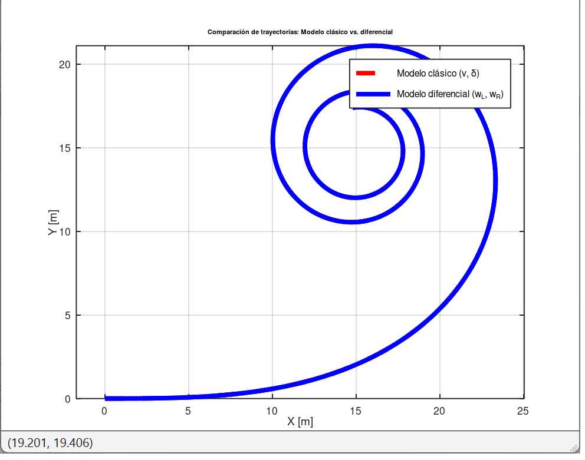

## MODELO DE ACKERMANN

## Esquema del vehículo Ackermann


## Fórmulas de dirección del vehículo

Parámetros:

- **L**: distancia entre ejes  
- **w**: ancho de vía 
- **R**: radio de giro  
- **δᵢ**: ángulo de dirección de la rueda interior  
- **δₒ**: ángulo de dirección de la rueda exterior  
- **δ**: ángulo de dirección promedio  
- **Vg**: velocidad global


---

### Introduccion


Para incluir las velocidades de las ruedas en el modelo cinematico de ackermann se debe tomar al vehiculo como un cuerpo rigido, es decir que la velocidad promedio lineal del centro de la parte trasera del vehiculo es el promedio de las velocidades lineales de cada una de las ruedas(izquierda (L) y derecha (R)).


### Velocidad angular y lineal de cada rueda

$$
\begin{cases}
\dot{\theta_R}  = \frac{V_R}{r_t}   \\
\dot{\theta_L}  = \frac{V_L}{r_t}   \\
\end{cases}
$$

Por definicion, la velocidad angular es la razon entre la velocidad lineal y el radio de giro.


---

### Velocidad del vehículo

$$
2R \dot{\theta} = 2V_G = r_t \omega_R + r_t \omega_L \Rightarrow V_G = \frac{r_t \omega_R + r_t \omega_L}{2}
$$

Al tener un cuerpo rigido, la velocidad general del vehiculo (global) es el promedio de las velocidades tangenciales de las ruedas anexadas a la parte trasera del chasis.

Reemplazando $r_t w_R = V_R$ y $r_t w_L = V_L$ 

Se observa que en el cuerpo rigido la velocidad $V_G$ o la velocidad del vehiculo promedio es:

 $$
 V_G = \frac{V_R + V_L}{2} (1)
$$

Esto puede ser reemplazado en el modelo cinematico de Ackermann, permitiendo realizar una simulacion en la que se obtenga la trayectoria del vehiculo a partir del calculo de la velocidad promedio(lineal) de cada una de las ruedas traseras.

Con esto se conforma el diferencial electronico, ya que simulando los resultados, podemos predecir el comportamiento de cada una de las ruedas de la parte trasera del chasis del vehiculo.

---

### Cálculo explícito de velocidades angulares
Resolviendo las ecuaciones anteriores para $w_o$ y $w_i$, se obtiene las distintas velocidades angulares para cada una de las ruedas

$$
\begin{aligned}
\omega_o &= \frac{V_G \left(2 + \frac{w}{R} \right)}{2r_t} \\
\omega_i &= \frac{V_G \left(2 - \frac{w}{R} \right)}{2r_t}
\end{aligned}
$$

Esto es de suma importancia, ya que nos permite calcular la velocidad angular de cada una de las ruedas, medida con un encoder y controlada por un controlador PID.


### Cinemática del centro del vehículo

$$
\begin{aligned}
\dot{X} &= V_G \cos(\theta) \\
\dot{Y} &= V_G \sin(\theta) \\
\dot{\theta} &= \frac{V_G}{R} = \frac{V_G}{\frac{L}{\tan(\delta)}} = \frac{V_G \tan(\delta)}{L}
\end{aligned}
$$

Aqui se puede observar que es relativamente sencillo relacionar los resultados de la simulacion previa, con la actual.

Si yo utilizo la velocidad de cada una de las ruedas, puedo obtener el angulo de giro actual, pudiendo relacionar directamente la velocidad angular izquierda y derecha con el modelo cinematico del centro del vehiculo.

Se puede deducir facilmente que:

$$
\begin{aligned}
\frac{w_R}{w_L}= \frac{(2+ \frac{w}{R})}{(2- \frac{w}{R})}
\end{aligned}
$$

Despejando R se obtiene que:

$$
\begin{aligned}
R = \frac{w_R w + w_Lw}{2(w_R-w_L)
}
\end{aligned}
$$

Y reemplazando: $r_t w_R = V_R$ y $r_t w_L = V_L$ 

se obtiene

$$
\begin{aligned}
R = \frac{r_tw(V_R  + V_L)}{2r_t(V_R-V_L) 
}
\end{aligned}
$$

$$
\begin{aligned}
R = \frac{w(V_R  + V_L)}{2(V_R-V_L) 
}
\end{aligned}(2)
$$


Sabiendo que el ratio de cambio de un angulo se calcula como:
$$
\dot{\theta}  = \frac{V}{R}   \\
$$

El cambio en el angulo de yaw (nariz) del automovil sera:

$$
\dot{\psi_y}  = \frac{V_G}{R}  (3) \\
$$

Se reemplazan las ecuaciones anteriores $V_G$ (1) y $R$ (2) en $\psi_y$(3), quedando:


$$
\dot{\psi_y}  = \frac{V_R - V_L}{w}  (4) \\
$$


---


### Simulacion:

``` matlab
% Ackermann simulacion
%
clear; clc; close all;

%% Parámetros del vehículo
v   = 2;      % velocidad longitudinal "nominal" [m/s]
L   = 2.5;    % distancia entre ejes [m]
Tsim= 30;     % tiempo de simulación [s]
dt  = 0.01;   % paso de integración [s]
w   = 1;      % distancia entre ruedas traseras [m]
rt  = 0.75;   % radio de ruedas traseras [m]

%% Discretización
N = floor(Tsim/dt) + 1;
t = (0:N-1)*dt;

%% Inicialización
Xpos  = zeros(1,N);
Ypos  = zeros(1,N);
theta = zeros(1,N);
delta = zeros(1,N);   % ángulo de giro
w_R   = zeros(1,N);   % vel. ang. rueda derecha [rad/s]
w_L   = zeros(1,N);   % vel. ang. rueda izquierda [rad/s]

% Condiciones iniciales
Xpos(1) = 0;
Ypos(1) = 0;
theta(1) = 0;

%% Simulación (Euler explícito)
for k = 1:N-1
    % steering angle: de 0 a pi/4 en 30 s
    delta(k) = (pi/4)*(t(k)/Tsim);

    % velocidades angulares de ruedas traseras (cinemática diferencial Ackermann)
    w_R(k) = (v/rt) * ((2*L + w*tan(delta(k)))/(2*L));
    w_L(k) = (v/rt) * ((2*L - w*tan(delta(k)))/(2*L));

    % velocidades lineales de cada rueda
    v_R = w_R(k)*rt;
    v_L = w_L(k)*rt;

    % velocidad media y yaw rate
    v_c     = (v_R + v_L)/2;   % vel. del centro trasero
    yawRate = (v_R - v_L)/w;   % giro inducido por ruedas traseras,  se puede reemplazar por  yawRate = (v_R + v_L)/(2*(L/tan(delta2(k))));

    % modelo cinemático
    dx     = v_c * cos(theta(k));
    dy     = v_c * sin(theta(k));
    dtheta = yawRate;

    % integración Euler
    Xpos(k+1)  = Xpos(k)  + dx*dt;
    Ypos(k+1)  = Ypos(k)  + dy*dt;
    theta(k+1) = theta(k) + dtheta*dt;
end
delta(end) = pi/4;
w_R(end)   = w_R(end-1);
w_L(end)   = w_L(end-1);

%% Graficar trayectoria
figure;
plot(Xpos,Ypos,'LineWidth',2);
xlabel('X [m]'); ylabel('Y [m]');
title('Trayectoria vehículo (Ackermann con cinemática diferencial)');
grid on; axis equal;

%% Graficar ángulo de giro
figure;
plot(t, rad2deg(delta), 'LineWidth', 2);
xlabel('Tiempo [s]');
ylabel('Ángulo de giro \delta [°]');
title('Ángulo de giro en función del tiempo');
grid on;

%% Graficar delta y velocidades juntas (doble eje Y)
if exist('yyaxis','file')   % MATLAB
    figure;
    yyaxis left
    plot(t, rad2deg(delta), 'LineWidth', 2);
    ylabel('\delta [°]');

    yyaxis right
    hold on;
    plot(t, w_R, 'LineWidth', 2);
    plot(t, w_L, 'LineWidth', 2);
    ylabel('\omega ruedas [rad/s]');

    xlabel('Tiempo [s]');
    title('\delta y velocidades angulares de ruedas');
    legend('\delta', '\omega_{R}', '\omega_{L}');
    grid on;

else                        % Octave: usar plotyy
    figure;
    [ax, h1, h2] = plotyy(t, rad2deg(delta), t, w_R);
    hold(ax(2), 'on');
    h3 = plot(ax(2), t, w_L, 'LineWidth', 2);

    set(h1, 'LineWidth', 2);
    set(h2, 'LineWidth', 2);
    set(h3, 'LineWidth', 2);

    xlabel('Tiempo [s]');
    ylabel(ax(1), '\delta [°]');
    ylabel(ax(2), '\omega ruedas [rad/s]');
    title('\delta y velocidades angulares de ruedas');
    legend([h1; h2; h3], '\delta', '\omega_{R}', '\omega_{L}');
    grid(ax(1), 'on'); grid(ax(2), 'on');
end

end

```


---

#### Analisis post-correccion

Se puede superponer la correccion actual con el codigo de simualcion previo.

Lo que se espera de esta simulacion es que el angulo de giro sea el apropiado y que la trayectoria seguida por el automovil, participando en el calculo de la posicion actual pura y exclusivamente el uso de las velocidades angulares y lineales de cada rueda, es que se superpongan perfectamente, ya que en el primer caso (sin corregir) se modela teoricamente la trayectoria directamente y en el segundo caso(corregido), se modela el movimiento a partir de las condiciones de las ruedas traseras.

Resultado:


En la imagen se simula en rojo el modelo clasico de ackermann y en azul el calculo de la trayectoria a partir de las velocidades angulares de las ruedas traseras.


## Codigo superpuesto:

```matlab
% Comparación de modelos Ackermann
% 1) Modelo clásico (con v y delta)
% 2) Modelo diferencial (con w_L y w_R en la cinemática)

clear; clc; close all;

%% Parámetros del vehículo
v   = 3;      % velocidad longitudinal nominal [m/s]
L   = 2.5;    % distancia entre ejes [m]
Tsim= 30;     % tiempo de simulación [s]
dt  = 0.01;   % paso de integración [s]
w   = 1;      % distancia entre ruedas traseras [m]
rt  = 0.75;   % radio de ruedas traseras [m]

%% Discretización
N = floor(Tsim/dt) + 1;
t = (0:N-1)*dt;

%% Inicialización (modelo clásico)
Xpos1  = zeros(1,N);
Ypos1  = zeros(1,N);
theta1 = zeros(1,N);
delta1 = zeros(1,N);

%% Inicialización (modelo diferencial)
Xpos2  = zeros(1,N);
Ypos2  = zeros(1,N);
theta2 = zeros(1,N);
delta2 = zeros(1,N);
w_R = zeros(1,N);
w_L = zeros(1,N);

% Condiciones iniciales
Xpos1(1)=0; Ypos1(1)=0; theta1(1)=0;
Xpos2(1)=0; Ypos2(1)=0; theta2(1)=0;

%% Simulación
for k = 1:N-1
    % steering angle (mismo en ambos modelos)
    delta1(k) = (pi/4)*(t(k)/Tsim);
    delta2(k) = delta1(k);

    %% Modelo 1: Ackermann clásico
    dx1     = v*cos(theta1(k));
    dy1     = v*sin(theta1(k));
    dtheta1 = (v/L)*tan(delta1(k));

    Xpos1(k+1)  = Xpos1(k)  + dx1*dt;
    Ypos1(k+1)  = Ypos1(k)  + dy1*dt;
    theta1(k+1) = theta1(k) + dtheta1*dt;

    %% Modelo 2: con velocidades de ruedas
    % velocidades angulares de ruedas traseras
    w_R(k) = (v/rt) * ((2*L + w*tan(delta2(k)))/(2*L));
    w_L(k) = (v/rt) * ((2*L - w*tan(delta2(k)))/(2*L));

    % velocidades lineales de cada rueda
    v_R = w_R(k)*rt;
    v_L = w_L(k)*rt;

    % velocidad media y yaw rate diferencial
    v_c     = (v_R + v_L)/2;
    yawRate = (v_R - v_L)/w; % se puede reemplazar por    yawRate = (v_R + v_L)/(2*(L/tan(delta2(k))));

    dx2     = v_c * cos(theta2(k));
    dy2     = v_c * sin(theta2(k));
    dtheta2 = yawRate;

    Xpos2(k+1)  = Xpos2(k)  + dx2*dt;
    Ypos2(k+1)  = Ypos2(k)  + dy2*dt;
    theta2(k+1) = theta2(k) + dtheta2*dt;
end

%% Graficar trayectorias
figure;
plot(Xpos1,Ypos1,'r--','LineWidth',2); hold on;
plot(Xpos2,Ypos2,'b','LineWidth',2);
xlabel('X [m]'); ylabel('Y [m]');
title('Comparación de trayectorias: Modelo clásico vs. diferencial');
legend('Modelo clásico (v, \delta)','Modelo diferencial (w_L, w_R)');
grid on; axis equal;

%% Graficar ángulo de giro
figure;
plot(t, rad2deg(delta1), 'LineWidth', 2);
xlabel('Tiempo [s]');
ylabel('Ángulo de giro \delta [°]');
title('Ángulo de giro en función del tiempo (común a ambos modelos)');
grid on;

%% Graficar velocidades angulares de ruedas (modelo diferencial)
figure;
plot(t, w_R, 'LineWidth', 2); hold on;
plot(t, w_L, 'LineWidth', 2);
xlabel('Tiempo [s]');
ylabel('\omega ruedas [rad/s]');
title('Velocidades angulares de ruedas (modelo diferencial)');
legend('\omega_R','\omega_L');
grid on;

```


